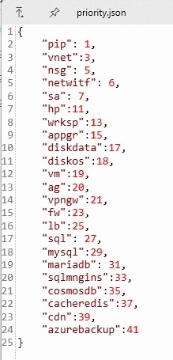

**How to config and run Application**

**Be Prepared:**

- Java JDK 11
- Azure CLI
- Maven 3.x

1. **Login Azure CLI**

Using Azure shell on portal.azure.com.

Setup authen:

- Get ID: az account show
- Get Authen:

**az ad sp create-for-rbac --name [YourAppName] --role Contributor --scopes /subscriptions/[SubscriptionID]**

Output:

{

"appId": "28ae4550-xxxxxxxxxxxxxxxxxxxx",

"displayName": "YourAppName",

"password": "xxxxxxxxxxxxxxxxxxxxxxxx",

"tenant": "xxxxxxxxxxxxxxxxxxxxxxxx"

}

- AZURE\_SUBSCRIPTION\_ID: is Subscription ID
- AZURE\_CLIENT\_ID: is appID
- AZURE\_CLIENT\_SECRET: is password
- AZURE\_TENANT\_ID: is tenant

Using Azure CLI on your OS’s terminal, this command can help you login azure CLI:

**az login --service-principal -u xxxxxxxxxxxxxxxxxxxxxx -p xxxxxxxxxxxxxxxxxxxxxxxx --tenant xxxxxxxxxxxxxxxxxxxxxxxxxxx**

1. **Move all projects to a folder**

Example:

In root folder, D:\Document\dmoa\single

We move all projects (cmc, dkr, … ) to the root folder.

In every project, we have to export template on Azure to here, then unzip them.

1. **Config enviroment variable for OS**

We have to create 3 variables in your OS’s Enviroment Variables:

+ ROOT_PATH_DEPLOY: It’s root folder

Example: D:\Document\dmoa\single

+ SUBSCRIPTION_ID: can get from authen information in step 1

+ TENAN_ID: can get from authen information in step 1

1. **Config file: priority.json**

In your root path, create a new file: **priority.json**

Example:

1. **Config file: config.json for each project**

Create a new file: config.json for each your project.

We have to config some information for the automation, such as: resource group name, region name, scheduler to create or delete resources, …

1. **Run your application**
    - Run in IntelliJ
        - Open folder in IntelliJ.
        - Wait for import dependencies
        - Finally, Click Green Arrow “RUN” in the main application class

- Run with java command
    - Verify java: **java –version**

- Verify maven: **mvn –version**

- Verify you are in your project: **dir**

- Re-create folder target: **mvn -U clean package**

- Go to folder ./target: **cd target**

- Run the application: **java -jar azure-sdk-with-java-sample-0.0.1-SNAPSHOT.jar**

